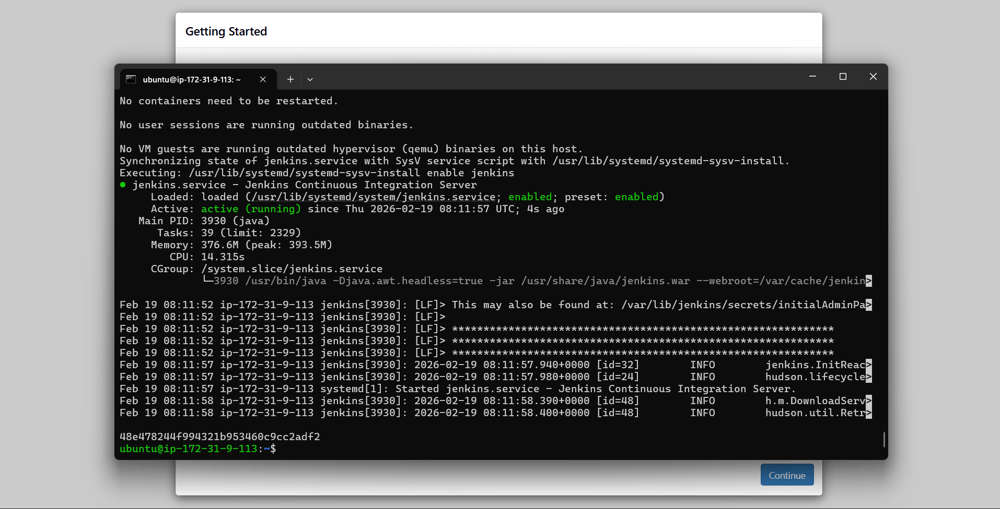
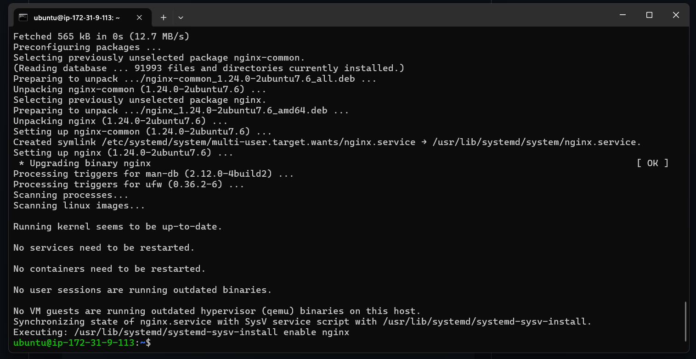
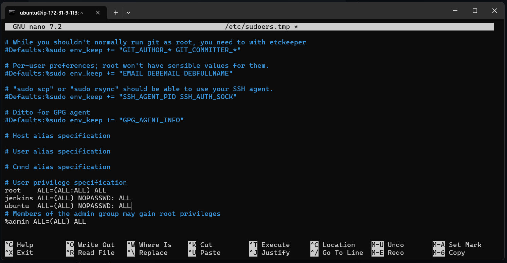
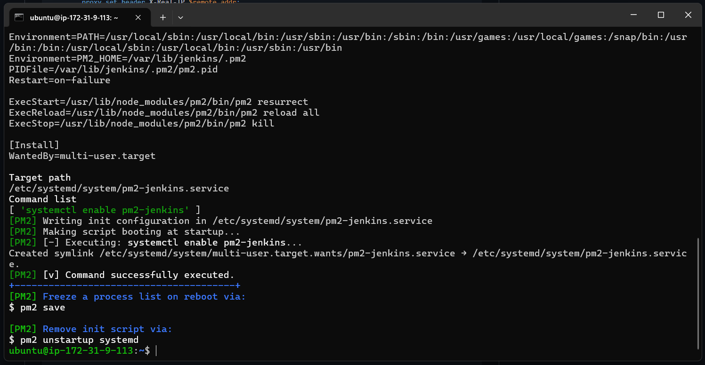
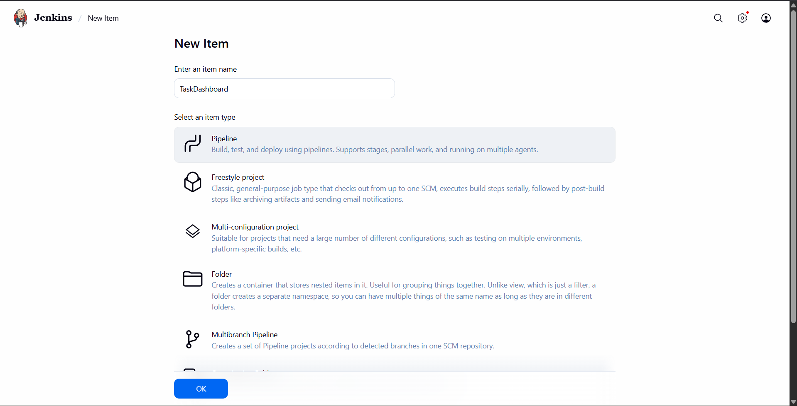
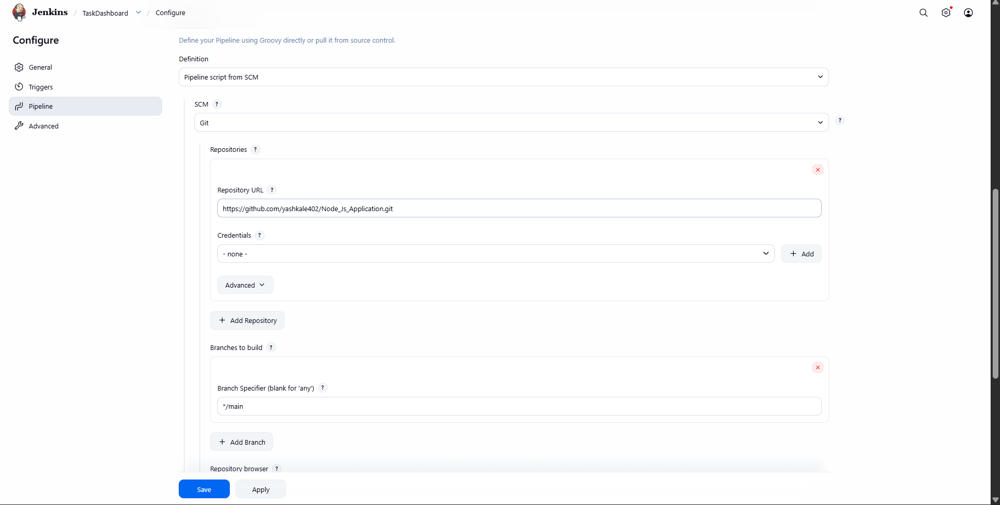
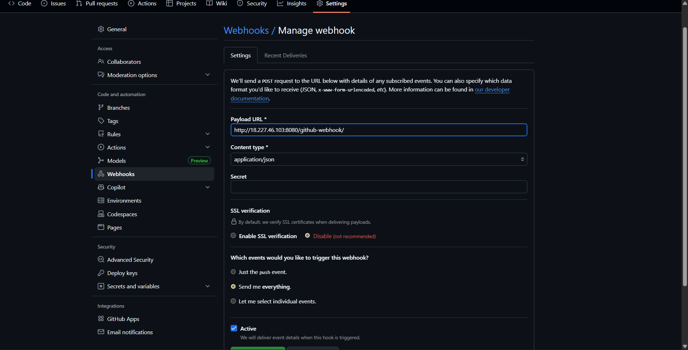
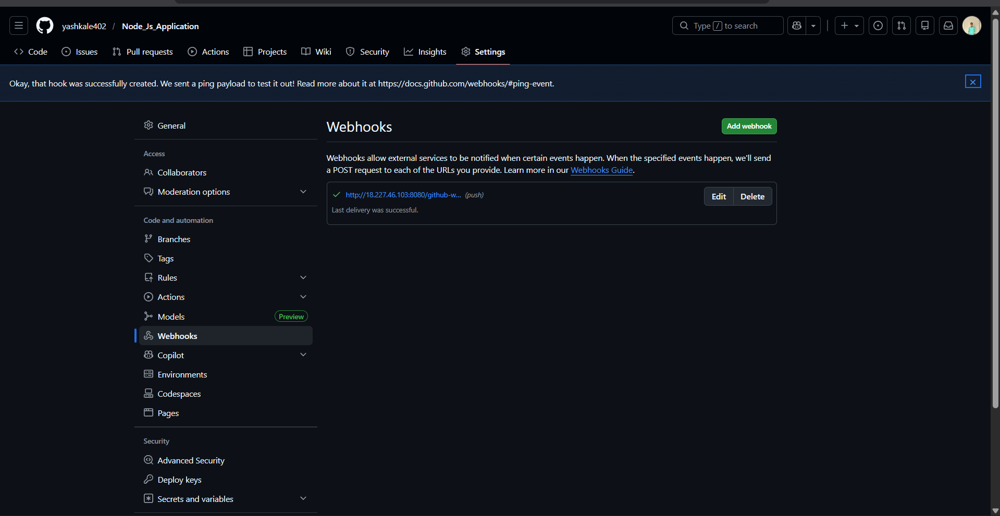
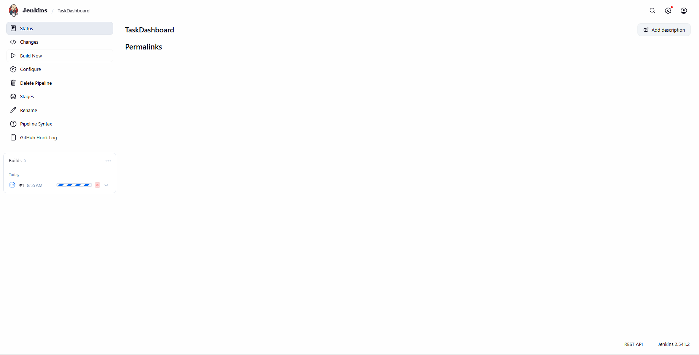

# 📋 Node.js Task Dashboard — CI/CD with Jenkinss

A real-time collaborative task management application built using **Node.js**, **Express**, **Socket.io**, **Sequelize**, and **SQLite**, with fully automated CI/CD using **Jenkins + PM2 + Nginx** on an Ubuntu EC2 instance.

> 🚀 Once configured, every `git push` automatically deploys your app!

---

## 🔄 How the System Works

```
Developer pushes code to GitHub
        ↓
GitHub Webhook triggers Jenkins
        ↓
Jenkins pulls latest code
        ↓
Jenkins deploys code to /var/www/html
        ↓
Dependencies installed (npm install)
        ↓
PM2 restarts the Node.js app
        ↓
Nginx listens on port 80 and proxies to port 3000
```

- ✅ Server setup is done **once**
- ✅ Deployments are **fully automatic**

---

## 🛠️ One-Time EC2 Server Setup

> Run these steps **ONLY ONCE** after creating your Ubuntu EC2 instance.

### Step 1 — Install Jenkins & Java 

```bash
# Update system
sudo apt update

# Install Java (required)
sudo apt install -y fontconfig openjdk-21-jre
java -version

# Prepare keyring folder
sudo mkdir -p /etc/apt/keyrings

# Add Jenkins repo key
sudo wget -O /etc/apt/keyrings/jenkins-keyring.asc \
https://pkg.jenkins.io/debian-stable/jenkins.io-2026.key

# Add Jenkins repo
echo "deb [signed-by=/etc/apt/keyrings/jenkins-keyring.asc]" \
https://pkg.jenkins.io/debian-stable binary/ | sudo tee \
/etc/apt/sources.list.d/jenkins.list > /dev/null

# Install Jenkins
sudo apt update
sudo apt install -y jenkins

# Start Jenkins
sudo systemctl enable jenkins
sudo systemctl start jenkins
sudo systemctl status jenkins

# Get Jenkins password
 sudo cat /var/lib/jenkins/secrets/initialAdminPassword
```



Open Jenkins in your browser:

```
http://<EC2_PUBLIC_IP>:8080
```

### Step 2

— Install Node.js 20 & PM2

```bash
curl -fsSL https://deb.nodesource.com/setup_20.x | sudo -E bash -
sudo apt install -y nodejs

node -v
npm -v

sudo npm install -g pm2
```


### Step 3 — Install and Enable Nginx

```bash
sudo apt install nginx -y
sudo systemctl start nginx
sudo systemctl enable nginx
```


### Step 4 — Sudoers Configuration

Add the following entries to the `/etc/sudoers` file using `visudo`:

1. Open the sudoers file safely using `visudo`:
   ```bash
   sudo visudo
   ```

2. Add the above lines at the **end** of the file.
 ```
jenkins ALL=(ALL) NOPASSWD: ALL
ubuntu  ALL=(ALL) NOPASSWD: ALL
```


3. Save and exit the editor.

> ⚠️ **Warning:** Granting `NOPASSWD: ALL` gives full passwordless root access. Use with caution in production environments.

### Step 5 — Configure Nginx Reverse Proxy (Port 80 → 3000)

```bash
sudo nano /etc/nginx/sites-available/default
```

Replace everything with:

```nginx
server {
    listen 80;
    server_name _;

    location / {
        proxy_pass http://localhost:3000;
        proxy_http_version 1.1;

        proxy_set_header Upgrade $http_upgrade;
        proxy_set_header Connection 'upgrade';

        proxy_set_header Host $host;
        proxy_set_header X-Real-IP $remote_addr;
        proxy_set_header X-Forwarded-For $proxy_add_x_forwarded_for;

        proxy_cache_bypass $http_upgrade;
    }
}
```
.png)

Apply the config:

```bash
sudo nginx -t
sudo systemctl restart nginx
```

### Step 6 — Setup PM2 Auto-Start (System Reboot Safe)

```bash
sudo env PATH=$PATH:/usr/bin pm2 startup systemd -u jenkins --hp /var/lib/jenkins
```

---


## 🗄️ SQLite Database Setup

> ⚠️ **CRITICAL — ONE TIME SETUP**
> SQLite database is **NOT** stored in GitHub — it **must** exist on the server.
> Skipping this step will cause a `SQLITE_CANTOPEN` error ❌
> 

```bash
sudo -i
cd /var/www/html
touch database.sqlite
chown jenkins:jenkins database.sqlite
chmod 664 database.sqlite
```


---

## ⚙️ Environment Variables (.env)

```bash
cd /var/www/html
nano .env
```

Example `.env`:

```env
PORT=3000
NODE_ENV=production
```

---

# SQLite File & Folder Permissions Setup

This guide fixes ownership and permissions for your SQLite database and web directory on an Ubuntu server.

---

## Step 1 — Change Ownership of the Database File

> ⚠️ **Important**

```bash
sudo chown ubuntu:ubuntu database.sqlite
```

Makes the `ubuntu` user (and group) the owner of the database file, so your app running as that user can read/write it.

---

## Step 2 — Give Write Permission

```bash
chmod 664 database.sqlite
```

Sets permissions to `rw-rw-r--`:

| Who    | Permission  |
|--------|-------------|
| Owner  | Read, Write |
| Group  | Read, Write |
| Others | Read only   |

---

## Step 3 — Fix Folder Permissions

> ⚠️ **Very Important**

```bash
sudo chown -R ubuntu:ubuntu /var/www/html
chmod -R 755 /var/www/html
```

SQLite doesn't just need access to the **file** — it also needs to create a **lockfile** (`.sqlite-wal`, `.sqlite-shm`) in the **same directory**. Without directory write access, SQLite throws a `readonly database` error even if the file itself is writable.

The `-R` flag applies changes recursively to all files and subfolders inside `/var/www/html`.

---

## Verify the Changes

Run the following to confirm ownership and permissions are set correctly:

```bash
ls -la database.sqlite
ls -la /var/www/html
```

You should see `ubuntu ubuntu` as the owner/group on both entries.

---

## Note

If your web server runs as `www-data` instead of `ubuntu`, either:
- Add `www-data` to the `ubuntu` group, or
- Adjust the ownership to match your web server user.

## 🖥️ Jenkins Pipeline Job Setup

1. Open Jenkins → **New Item**
2. **Name:** `TaskDashboard`
3. **Type:** Pipeline
4. **Build Triggers:** ✅ GitHub hook trigger for GITScm polling
5. **Pipeline:**
   - Definition: `Pipeline script from SCM`
   - SCM: `Git`
   - 
   - Repo URL: `https://github.com/yashkale402/Node_Js_Application.git`
   - Branch: `*/main`
   - Script Path: `Jenkinsfile`
   - 
6. Click **Save **


---

## 🔗 GitHub Webhook Setup

Go to: **GitHub Repo → Settings → Webhooks → Add Webhook**

| Field | Value |
|---|---|
| Payload URL | `http://<EC2_IP>:8080/github-webhook/` |
| Content Type | `application/json` |
| Events | Push events |




---

## 🚀 Daily Deployment Workflow

Do this on your local system and GitHub webhook automatically trigger our build and deploy the Letest application.
```bash
git add .
git commit -m "new feature"
git push origin main
```




🎉 Jenkins automatically deploys your app!


---

## 📁 Project Structure

```
NodeJs-Application/
├── server.js
├── package.json
├── ecosystem.config.js
├── Jenkinsfile
├── database.sqlite      # created on server (not in Git)
├── public/
├── src/
│   ├── config/
│   ├── controllers/
│   ├── models/
│   └── routes/
└── views/
```

---

## 🔧 Troubleshooting

| Issue | Fix |
|---|---|
| `SQLITE_CANTOPEN` | Create `database.sqlite` + fix ownership |
| PM2 keeps restarting | DB or permission issue |
| App not on port 80 | Check Nginx status |
| Jenkins build fails | Check console output |
| Webhook not firing | Check GitHub deliveries |
| Works once, breaks after deploy | Jenkins overwrote permissions |

Fix permissions anytime with:

```bash
sudo chown -R jenkins:jenkins /var/www/html
```

---

## 🔒 EC2 Security Group Rules

| Type | Port |
|---|---|
| HTTP | 80 |
| Jenkins | 8080 |
| SSH | 22 |

---

## 🧠 Final Notes

- 🗃️ SQLite is fine for **demos & learning**
- 🏭 For production, prefer **MySQL** or **PostgreSQL**
- 🔐 Always **separate code and data**
- ⚙️ **Permissions matter more than code** in DevOps

---

## ✅ Result

| Feature | Status |
|---|---|
| Fully automated CI/CD | ✔ |
| Zero manual deployments | ✔ |
| PM2 process recovery | ✔ |
| Nginx reverse proxy | ✔ |
| Production-ready workflow | ✔ |
